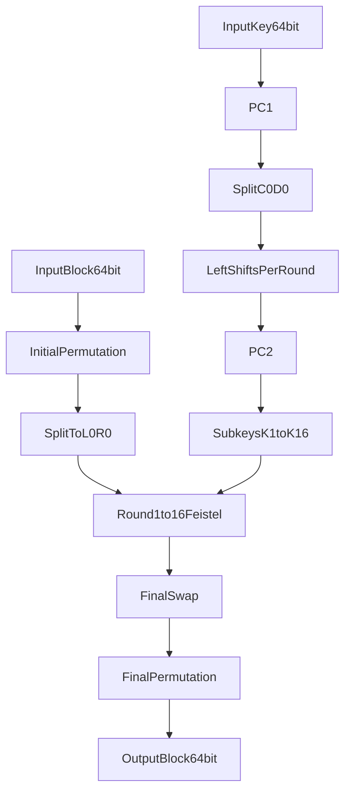

# Laporan Implementasi DES (Data Encryption Standard)

## 1. Tujuan dan Ruang Lingkup

Dokumen ini menjelaskan implementasi algoritma DES secara manual pada program terminal Python. Fokus laporan:

1. Menjelaskan konsep DES secara sistematis.
2. Menjabarkan alur enkripsi/dekripsi langkah demi langkah.
3. Menunjukkan hubungan teori DES dengan implementasi kode.
4. Membuktikan kebenaran implementasi melalui pengujian.

Batasan implementasi:

- Program berbasis console (tanpa UI).
- Implementasi DES inti (bukan 3DES).
- Proses data per blok 64-bit.

## 2. Landasan Teori DES

DES adalah algoritma kriptografi simetris berbasis blok. Simetris berarti kunci enkripsi dan dekripsi sama.

Karakteristik utama DES:

- Ukuran blok data: 64-bit.
- Ukuran kunci input: 64-bit.
- Kunci efektif: 56-bit (8 bit sisanya parity bit).
- Jumlah ronde: 16 ronde Feistel.

Struktur Feistel membuat enkripsi dan dekripsi memakai rangkaian operasi yang sama, yang dibedakan hanya urutan subkey.

## 3. Arsitektur Umum Proses DES



Secara garis besar, ada dua alur paralel:

- Alur data: `IP -> 16 ronde Feistel -> swap -> FP`.
- Alur kunci: `PC1 -> shift per ronde -> PC2 -> 16 subkey`.

## 4. Penjelasan Detail Tahap DES

### 4.1 Persiapan Input

Program menerima parameter:

- `mode`: `encrypt` atau `decrypt`
- `data`: plaintext/ciphertext
- `key`: 16 hex karakter (64-bit)
- `input-format`: `hex` atau `text`

Aturan validasi:

- Key harus tepat 16 karakter heksadesimal.
- Jika `input-format=hex`, panjang data harus kelipatan 16 hex (1 blok DES).
- Jika `input-format=text`, plaintext diubah ke byte dan dipadding agar kelipatan 8 byte.

### 4.2 Initial Permutation (IP)

Blok 64-bit dipermutasi menggunakan tabel `IP`. Permutasi ini mengacak ulang posisi bit secara deterministik.

Output IP dibagi menjadi:

- `L0` (32-bit kiri)
- `R0` (32-bit kanan)

### 4.3 Key Schedule (Pembangkitan 16 Subkey)

Langkah pembangkitan subkey:

1. Key 64-bit dipermutasi dengan `PC1`, menghasilkan 56-bit.
2. Hasil dibagi menjadi `C0` dan `D0` (28-bit, 28-bit).
3. Untuk ronde ke-`i` (1 sampai 16):
   - `Ci` dan `Di` di-left-rotate sesuai `SHIFT_SCHEDULE`.
   - `Ci || Di` dipermutasi dengan `PC2`.
   - Hasilnya subkey `Ki` sepanjang 48-bit.

Kenapa 48-bit? Karena pada fungsi ronde, bagian kanan blok (`R`) diekspansi dari 32-bit menjadi 48-bit agar bisa di-XOR dengan subkey.

### 4.4 Ronde Feistel

Setiap ronde DES menggunakan persamaan:

- `Li = R(i-1)`
- `Ri = L(i-1) XOR f(R(i-1), Ki)`

Ronde ini dijalankan 16 kali.

### 4.5 Detail Fungsi `f(R, K)`

Fungsi ronde `f` terdiri dari 4 tahap:

1. **Ekspansi (E Expansion)**
   - `R` 32-bit dipetakan menjadi 48-bit menggunakan tabel `E`.
2. **Key Mixing**
   - Hasil ekspansi di-XOR dengan subkey `Ki` (48-bit).
3. **Substitusi S-Box**
   - Data 48-bit dibagi menjadi 8 bagian, masing-masing 6-bit.
   - Tiap bagian masuk ke S-Box yang sesuai (`S1` sampai `S8`).
   - Setiap 6-bit menghasilkan 4-bit output.
   - Total keluaran jadi 32-bit.
4. **Permutasi P**
   - Output 32-bit dari S-Box dipermutasi dengan tabel `P`.

Tahap S-Box adalah sumber non-linearitas utama DES yang membuat hubungan plaintext-key-ciphertext tidak linear.

### 4.6 Final Swap dan Final Permutation

Setelah ronde ke-16 didapat `L16` dan `R16`.

1. Dilakukan pertukaran akhir: `R16 || L16`.
2. Hasilnya dipermutasi dengan `FP` (inverse dari IP).
3. Keluaran 64-bit dikonversi ke format hex.

## 5. Enkripsi vs Dekripsi

Keunggulan struktur Feistel: logika inti sama untuk enkripsi maupun dekripsi.

- Enkripsi: subkey urut `K1, K2, ..., K16`.
- Dekripsi: subkey urut terbalik `K16, K15, ..., K1`.

Karena itu fungsi internal tetap sama; yang berubah hanya urutan subkey.

## 6. Implementasi pada Project

### 6.1 `src/des_core.py`

Berisi implementasi inti DES:

- Konstanta tabel: `IP`, `FP`, `E`, `P`, `PC1`, `PC2`, `SHIFT_SCHEDULE`, `S_BOX`.
- Fungsi utilitas bit-level:
  - `_permute(...)`
  - `_xor(...)`
  - `_left_rotate(...)`
- Fungsi inti:
  - `generate_subkeys(key_hex_64)`
  - `_f_function(right32, subkey48)`
  - `_des_block_bits(data64_bits, subkeys, verbose=False)`
  - `des_encrypt_block(block64, key64, verbose=False)`
  - `des_decrypt_block(block64, key64, verbose=False)`

### 6.2 `src/des_utils.py`

Berisi utilitas pemrosesan data:

- Konversi text dan hex.
- Pemecahan data hex menjadi blok 64-bit.
- `pkcs7_pad(...)` dan `pkcs7_unpad(...)` untuk mode input text.
- Validasi format data hex.

### 6.3 `src/des_cli.py`

Berisi antarmuka terminal:

- Parsing argumen CLI.
- Pemilihan mode `encrypt/decrypt`.
- Pemilihan format input `hex/text`.
- Opsi `--verbose` untuk menampilkan jejak proses pada blok pertama.

## 7. Alur Eksekusi Program di CLI

1. User memberi mode, data, key, format input.
2. Program validasi parameter.
3. Data dibagi per blok 64-bit.
4. Tiap blok diproses DES.
5. Output blok digabung lalu ditampilkan.
6. Untuk mode dekripsi text: data hasil dekripsi di-unpadding lalu dikonversi ke string.

## 8. Contoh Penggunaan

### 8.1 Enkripsi Hex

```bash
python src/des_cli.py encrypt --input-format hex --data 0123456789ABCDEF --key 133457799BBCDFF1
```

Output:

```text
Ciphertext (HEX): 85E813540F0AB405
```

### 8.2 Dekripsi Hex

```bash
python src/des_cli.py decrypt --input-format hex --data 85E813540F0AB405 --key 133457799BBCDFF1
```

Output:

```text
Plaintext (HEX): 0123456789ABCDEF
```

### 8.3 Enkripsi Dekripsi Text Multi-Blok

Contoh plaintext:

`Belajar DES di kelas kriptografi`

Program akan:

- Ubah text ke byte.
- Tambahkan PKCS#7 padding.
- Proses tiap blok dengan DES.
- Saat dekripsi, padding dihapus kembali.

## 9. Verifikasi dan Analisis Hasil

### 9.1 Test Vector Standar

Data referensi:

- Plaintext: `0123456789ABCDEF`
- Key: `133457799BBCDFF1`
- Ciphertext referensi: `85E813540F0AB405`

Hasil implementasi:

- Ciphertext yang dihasilkan sama dengan referensi.
- Dekripsi ciphertext mengembalikan plaintext awal.

Ini menunjukkan implementasi tabel dan proses ronde berjalan benar.

### 9.2 Uji Round-Trip

Pengujian dilakukan untuk:

- Data hex multi-blok.
- Data text multi-blok dengan padding.

Kriteria lolos:

`decrypt(encrypt(data, key), key) == data`

Semua pengujian round-trip memenuhi kriteria.

### 9.3 Uji Validasi Input

Program juga diuji dengan input tidak valid:

- Panjang key salah.
- Data hex bukan kelipatan blok.
- Karakter non-heksadesimal.

Program memberikan pesan error yang jelas, sehingga mencegah proses kriptografi dengan parameter salah.

## 10. Kelebihan, Keterbatasan, dan Catatan Keamanan

Kelebihan implementasi:

- Proses DES ditulis manual, sesuai tujuan pembelajaran.
- Struktur kode dipisah antara core, utilitas, dan CLI.
- Mendukung input hex dan text.

Keterbatasan:

- Hanya DES tunggal, bukan 3DES.
- Belum menerapkan mode operasi blok modern (CBC/CTR/GCM).
- Ditujukan untuk tugas akademik, bukan produksi.

Catatan keamanan:

- DES secara praktis sudah dianggap lemah untuk kebutuhan keamanan modern karena panjang kunci efektif 56-bit relatif kecil.
- Untuk aplikasi nyata, disarankan menggunakan algoritma modern seperti AES.

## 11. Kesimpulan

Implementasi berhasil memenuhi ketentuan tugas:

1. Program console dapat melakukan enkripsi dan dekripsi DES.
2. Proses utama DES diimplementasikan manual (IP, key schedule, fungsi `f`, 16 ronde Feistel, FP).
3. Tersedia dokumentasi langkah demi langkah yang rinci.
4. Validasi melalui test vector dan uji round-trip menunjukkan hasil benar.
